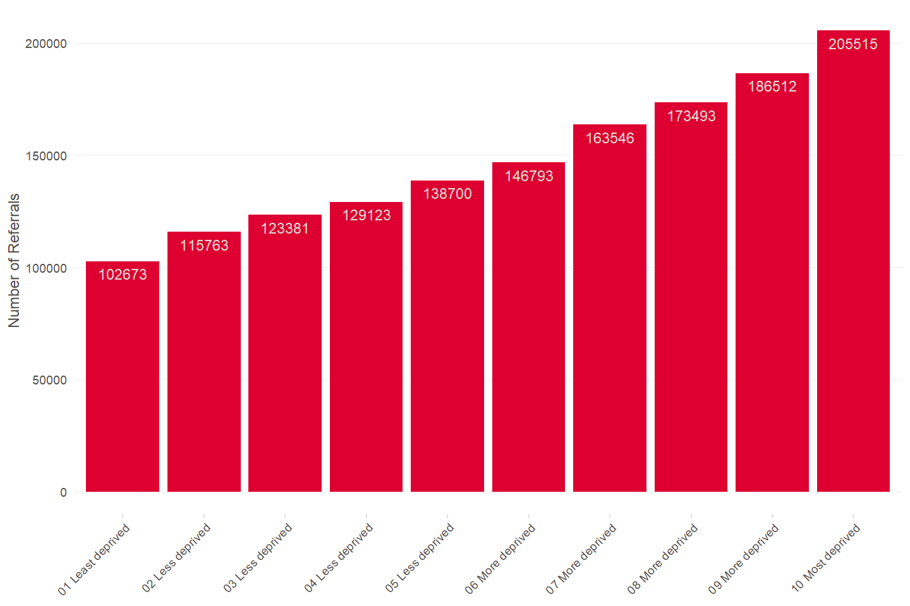
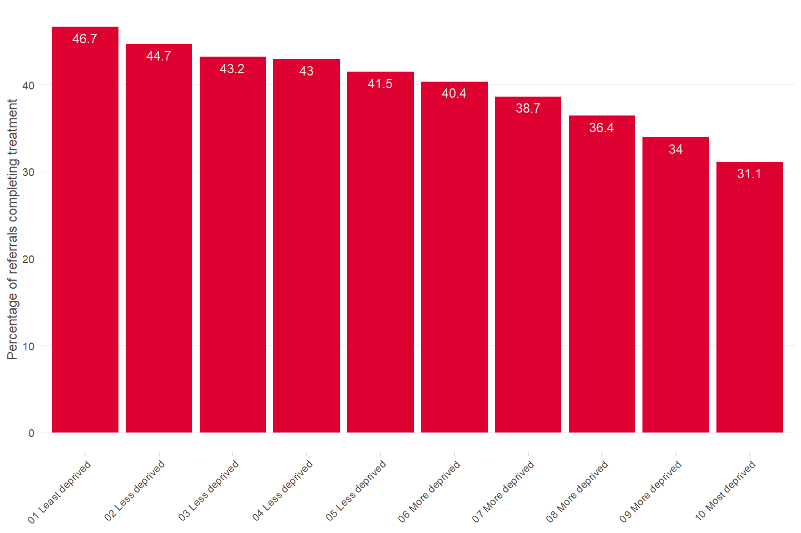
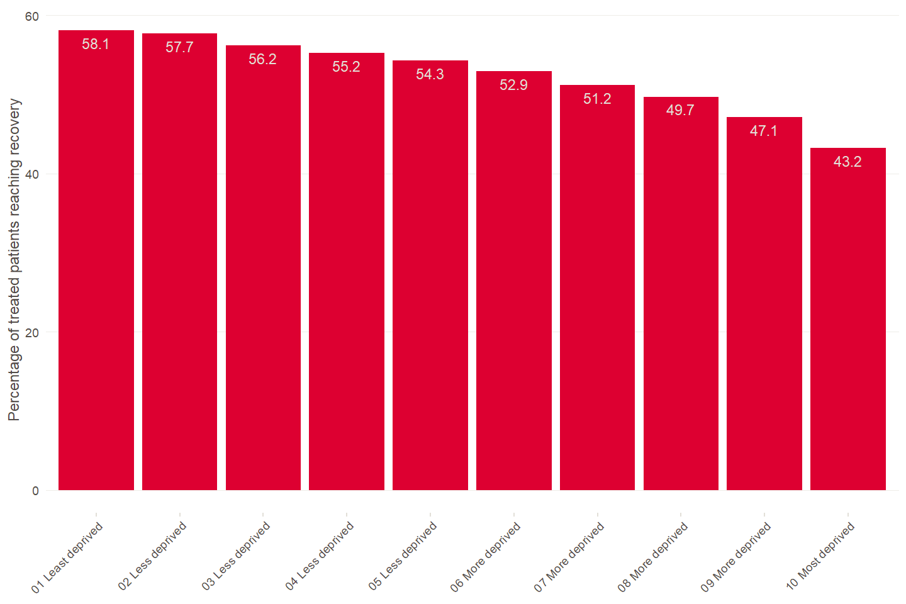

# Technical Appendix supporting the Health Foundation response to the government’s consultation on [“Advancing our health: prevention in the 2020s”](https://www.gov.uk/government/consultations/advancing-our-health-prevention-in-the-2020s/advancing-our-health-prevention-in-the-2020s-consultation-document)

#### *15th October 2019*

#### Karen Hodgson, Senior Data Analyst, The Health Foundation

## Variation in IAPT programme associated with level of deprivation

### Analysis description

This technical appendix highlights the patterns observed in the publicly
available data from the NHS IAPT (Increasing Access to Psychological
Therapies) programme. Aggregate data is made available regularly and
published by NHS Digital - here we take the annual data from
[2018/19](https://digital.nhs.uk/data-and-information/publications/statistical/psychological-therapies-annual-reports-on-the-use-of-iapt-services/annual-report-2018-19)
and highlight the variation in the dataset, by area-level deprivation
measures.

### Number of referrals in 2018/19

Figure 1 shows the number of referrals per deprivation decile which
ended in 2018/19.
<!-- --> *Figure
1*

### Percentage of referrals receiving treatment in 2018/19

In the IAPT programme, patients who have attended at least two treatment
appointments (excluding follow up) are considered to have completed
treatment. Figure 2 shows the percentage of patients per deprivation
decile with an ended referral in 2018/19 who completed treatment.
<!-- --> *Figure
2*

### Percentage of treated patients reaching recovery in 2018/19

Recovery in the IAPT dataset is defined using symptom scores for anxiety
or depression. A referral is considered to have moved to recovery if
they were defined as a clinical case at the begining of treatment, and
their symptoms were no longer severe enough to be defined as a clinical
cases at the end of their treatment. For further details see the [Guide
to IAPT data and
publications](https://digital.nhs.uk/binaries/content/assets/website-assets/data-and-information/data-sets/iapt/guide-to-iapt-data-and-publications.pdf).
The NHS national recovery standard is that 50% of patients who complete
treatment should achieve recovery.

Figure 3 shows the percentage of patients receiving treatment who
reached recovery, by deprivation decile.

<!-- --> *Figure
3*
